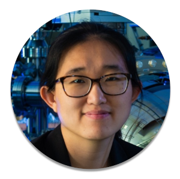
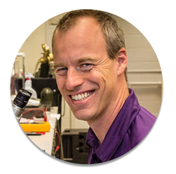
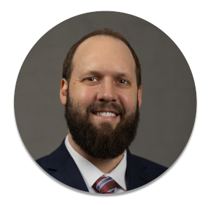
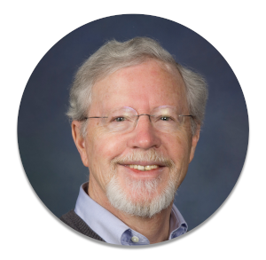
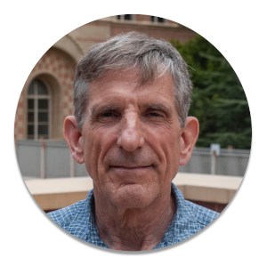
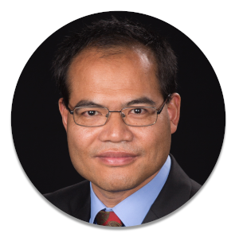

---
hide:
  - toc
title: Local Committee
---

## Organizing Committee

- 
{ align=center, width=50%, height=50% } <strong>Jian-Xin Zhu</strong>  <i>Los Alamos National Laboratory</i> 

- 
{ align=center, width=50%, height=50% } <strong>Mun Chan</strong>  <i>National High Magnetic Field Laboratory: Pulsed Field Facility</i>

- 
{ align=center, width=50%, height=50% } <strong>Elizabeth Krenkel</strong>  <i>Los Alamos National Laboratory</i>

- 
{ align=center, width=50%, height=50% } <strong>Christopher Lane</strong>  <i>Los Alamos National Laboratory</i>

- 
{ align=center, width=50%, height=50% } <strong>Ying Wai Li</strong>  <i>Los Alamos National Laboratory</i>

## Program Committee

- 
{ align=center, width=50%, height=50% } <strong>Filip Ronning</strong>  <i>Los Alamos National Laboratory</i> 

- 
{ align=center, width=50%, height=50% } <strong>Jed Pixley</strong>  <i>Rutger University</i>

- 
{ align=center, width=50%, height=50% } <strong>Joe D. Thompson</strong>  <i>Los Alamos National Laboratory</i>

- 
{ align=center, width=50%, height=50% } <strong>Stuart Brown</strong>  <i>University of California at Los Angeles</i>

- 
{ align=center, width=50%, height=50% } <strong>Ming Yi</strong>  <i>Rice University</i>

- 
{ align=center, width=50%, height=50% } <strong>Jian-Xin Zhu</strong>  <i>Los Alamos National Laboratory</i>

<!--
## Program Committee

-  { .lg .middle}__LLL__

-  { .lg .middle}__LLL__

-  { .lg .middle}__LLL__

-  { .lg .middle}__LLL__

-  { .lg .middle}__LLL__

## Organizing Committee
* Jian-Xin Zhu (Conference Chair), <i>Los Alamos National Laboratory</i>
* Mun Chan, <i>National High Magnetic Field Laboratory: Pulsed Field Facility</i>
* Elizabeth Krenkel, <i>Los Alamos National Laboratory</i>
* Christopher Lane, <i>Los Alamos National Laboratory</i>
* Ying Wai Li, <i>Los Alamos National Laboratory</i>

## Program Committee
* Filip Ronning (Chair), <i>Los Alamos National Laboratory</i>
* Jed Pixley (Co-Chair), <i>Rutger University</i>
* Joe D. Thompson, <i>Los Alamos National Laboratory</i>
* Stuart Brown, <i>University of California at Los Angeles</i>
* Ming Yi, <i>Rice University</i>
* Jian-Xin Zhu, <i>Los Alamos National Laboratory</i>
-->
<!--
## International Steering Committee
* Arun Bansil (Chair), <i>USA</i>
* Alexander Balatsky, <i>USA</i>
* Kevin Bedell, <i>USA</i>
* Juan Carlos Campuzano, <i>USA</i>
* Tom Devereaux, <i>USA</i>
* Donglai Feng, <i>China</i>
* Zahid Hussain, <i>USA</i>
* Sadamichi Maekawa, <i>Japan</i>
* Zhi-Xun Shen, <i>USA</i>
* Takashi Takahashi, <i>Japan</i>
* Lu Yu, <i>China</i>
* Zhong-Xian Zhao, <i>China</i>
* Hide Takagi, <i>Germany</i>
* Bernhard Keimer, <i>Germany</i>
* Atsushi Fujimori, <i>Japan</i>
* Tanmoy Das, <i>India</i>

##International Advisory Committee
* Peter Armitage, <i>John Hopkins University, USA</i>
* Ganapathy Baskaran, <i>Institute of Mathematical Sciences, India</i>
* Bernd Buechner, <i>IFW Dresden, Germany</i>
* Andrea Damascelli, <i>University of British Columbia, Canda</i>
* Seamus Davis, <i>Cornell University, USA</i>
* Tanmoy Das, <i>Indian Institute of Sciences, India</i>
* Ashok Ganguli, <i>IIT Delhi, India</i>
* Ali Gencer, <i>Ankara University, Turkey</i>
* Tetsuo Hanaguri, <i>RIKEN, Japan</i>
* Masatoshi Imada, <i>University of Tokyo, Japan</i>
* Yoshihiro Iwasa, <i>University of Tokyo, Japan</i>
* Aharon Kapitulnik, <i>Stanford University, USA</i>
* Changyoung Kim, <i>Seoul National University, Korea</i>
* Hiroshi Kontani, <i>Nagoya University, Japan</i>
* Gabriel Kotliar, <i>Rutgers University, USA</i>
* Ting-Kuo Lee, <i>Academia Sinica, Taiwan</i>
* Andrew Mackenzie, <i>Max-Planck Institute, Dresden</i>
* Yuji Matsuda, <i>Kyoto University, Japan</i>
* Takafumi Sato, <i>Tohoku University, Japan</i>
* Joerg Schmalian, <i>Karlsruhe Institute of Technology, Germany</i>
* Suchitra Sebastian, <i>University of Cambridge, UK</i>
* Manfred Sigrist, <i>ETH-Zuerich, Switzerland</i>
* Setsuko Tajima, <i>Osaka University, Japan</i>
* Jeff Tallon, <i>Victoria University of Wellington, New Zealand</i>
* John Tranquada, <i>Brookhaven National Laboratory, USA</i>
* Shinichi Uchida, <i>University of Tokyo, Japan</i>
* Yayu Wang, <i>Tsinghua University, China</i>
* Guo-qing Zheng, <i>Okayama University, Japan</i>
* Xingjiang Zhou, <i>IOP, CAS, China</i>
-->
